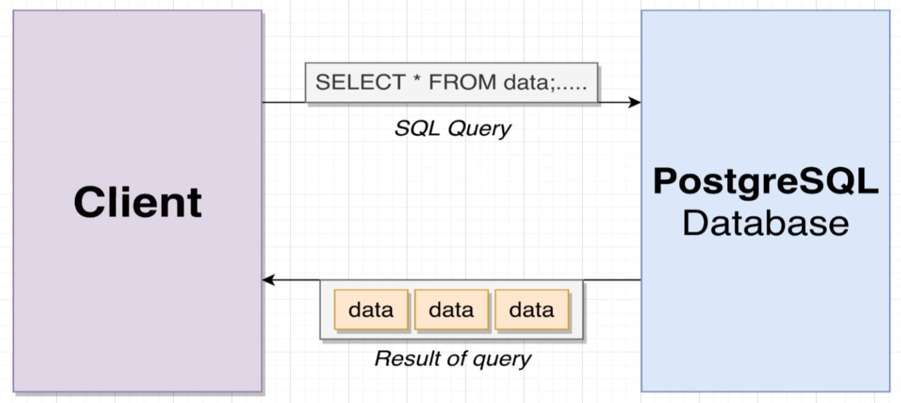
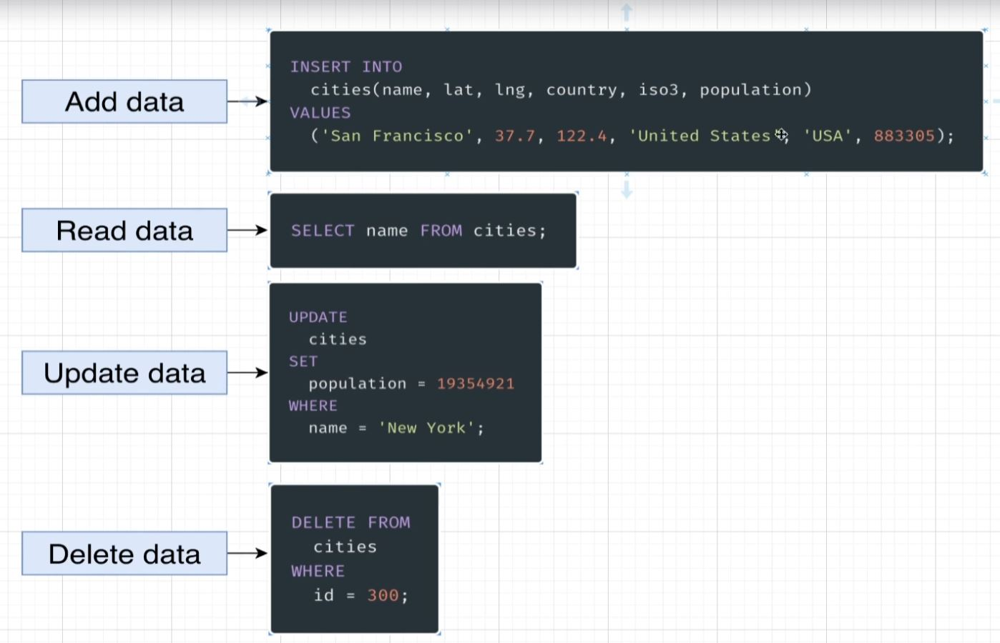

# Course Intro

 

## What is PostgreSQL All About?

- Databases store information
- PostgreSQL ( Postgres) is a type of database(db).
- We interface with our db via a **client**.
  - A **client** is a piece of software or web application designed to interact with the db to create, read, update, or delete data.

 

- We write SQL to interact with the db.
- SQL can be thought of as kind of like a programming language.
- SQL tells our database some information that we want to:
  - **CREATE**
  - **READ**
  - **UPDATE**
  - **DELETE**
- SQL is the most common way we will be interacting with our db.

- **SQL is very different than Postgres!**
  - SQL is a communication language, a set of instructions that allows us to interact with our db.
    - SQL is NOT specific to Postgres, it is used for a variety of different dbs.
      - You can transfer the knowledge to other dbs.

- **Focus of this course:**
  - Writing efficient queries to retrieve information 
  - Designing the schema, or structure, of the db
  - Understanding when to use advanced features
  - Managing the database in a production environment

[NEXT >>>](../1_Intro_and_SQL_Statements/index.md)