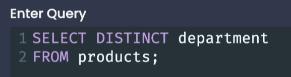
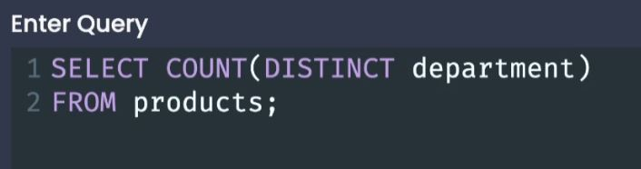

# Selecting Distinct Records

 

## Selecting Distinct Values

- `DISTINCT` - will give you all of the distinct values inside of a give column
- Distinct is **always going to be placed inside of a SELECT clause.**
  - the DISTINCT keyword always comes right after the SELECT keyword **or inside of the aggregate function parenthesis**.

 

- We can combine DISTINCT with aggregators like COUNT:

  - Notice that the DISTINCT is inside the COUNT parenthesis.
    
     

- We can add more than one column after the DISTINCT keyword to get the unique combinations of those columns put together:
  - - We cannot run a count function on more than one column (just a weird issue with pg).

