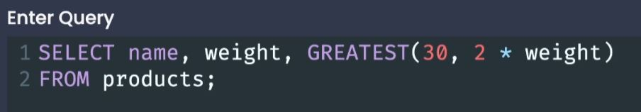
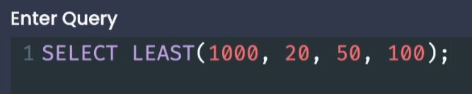

# Utility Operators, Keywords, and Functions

 

## GREATEST Function

- The `GREATEST()` will return the greatest of the given input values. 

 

## LEAST Function

- The `LEAST()` will return the least of the given input values. 

## Case

- `CASE` is the SQL version of a conditional statement.
  - It is always followed by the `END` keyword, closing off the conditional statement.
  - It is used in combinations with the keywords:
    - `WHEN` - Think of like "if true", **WHEN is followed by a condition**.
    - `THEN` - What to execute if the condition evaluates to true.
    - `ELSE` - What to execute if the condition evaluates to false.