# PostgreSQL Complex Datatypes

 

## PGAdmin and Postgres Server

- PGAdmin - Tool to manage and inspect a Postgres database. - Can connect to local or remote databases (e.g. AWS). - Can view/change just about anything in PG.
   

- Postgres Server
  - When we download pg we are running a pg server locally.
  - A pg server can contain multiple databases.
  - All data for a single application lives on a single db.
  - Having multiple DBs is more about working with more than one app on your machine.

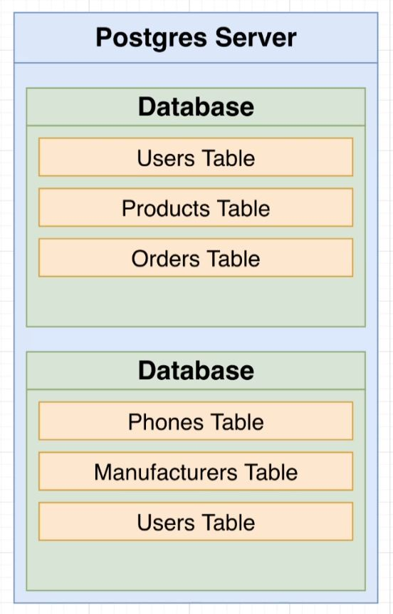
 

## Data Types

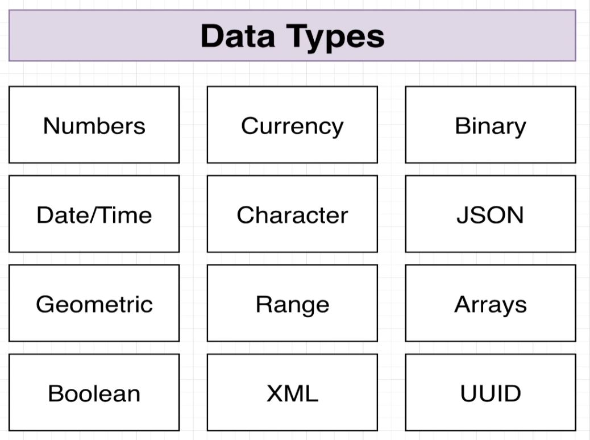

- These are **CATEGORIES**.
  - They contain subtypes that we can make use of.
- Most important:
  - **Numbers**
  - **Date/Time**
  - **Character**
  - **Boolean**
     

## Numeric Types

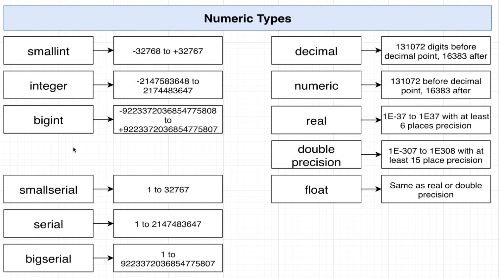
 

## Rules on Numeric Data Types

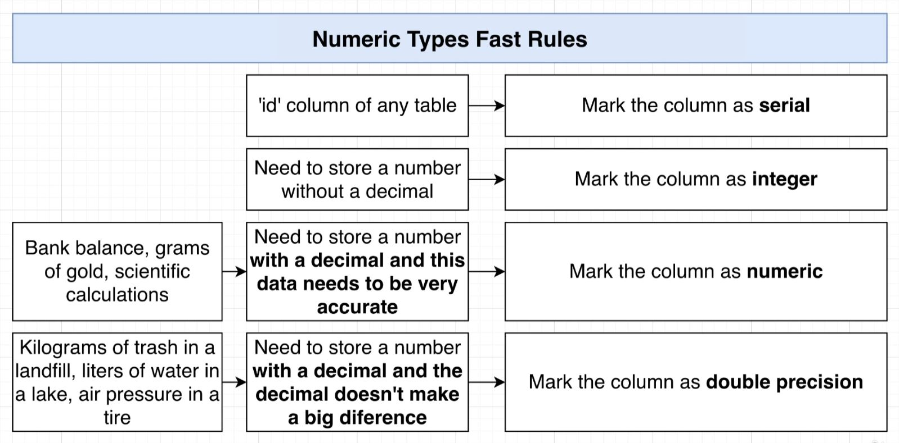

- **TYPECASTING:**

  - We can get pg to typecast a value by adding `::<datatype>` after the value we wish to cast.
    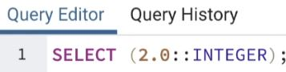
     

- FLOATING POINT MATH:
  - **The decimal value is often inaccurate in:**
    - real
    - double precision
    - float
    - **But, much more efficient to run.**
  - Less efficient but 100% accurate: - decimal - numeric - Essentially the same.
     

## Character Types:

- **There is NO performance difference between the different char types. So pick whatever one fits your needs.**
  - The char length in CHAR(#) and VARCHAR(#) is just to impose a limit.

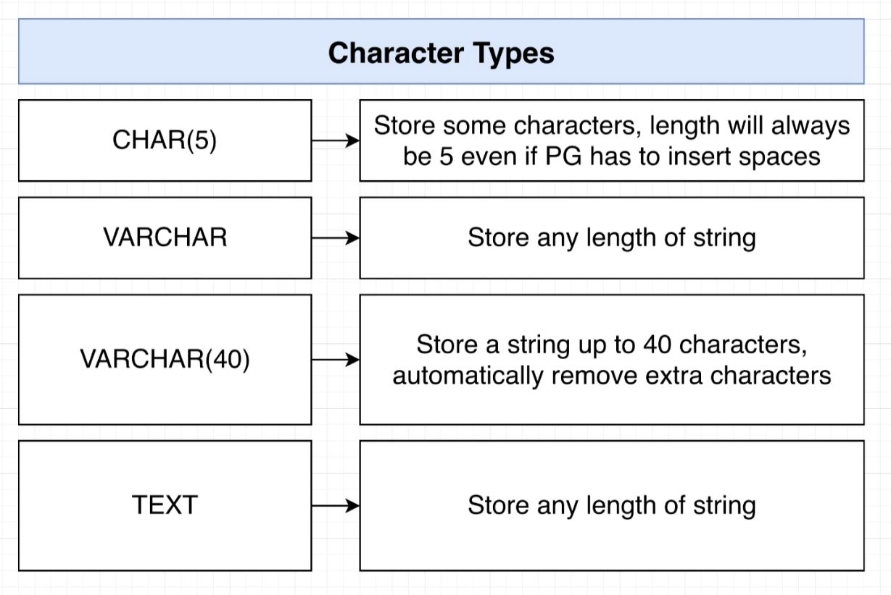
 

## Boolean Data Types

- Some of these values are strings to begin with:

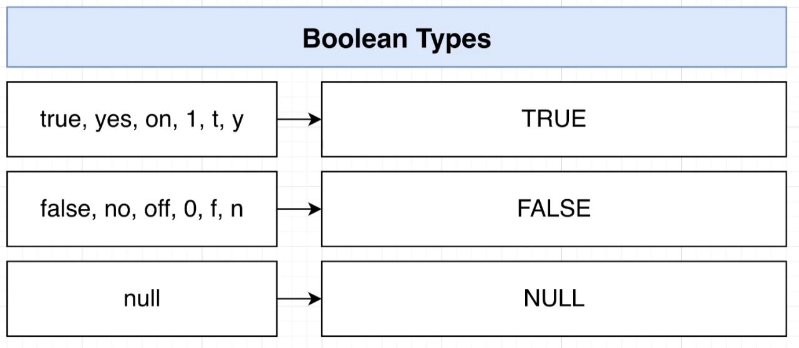
 

## Dates

- You can provide a string of just about any type and pg is going to format it for you.
  - it will format it to YYYY-MM-DD

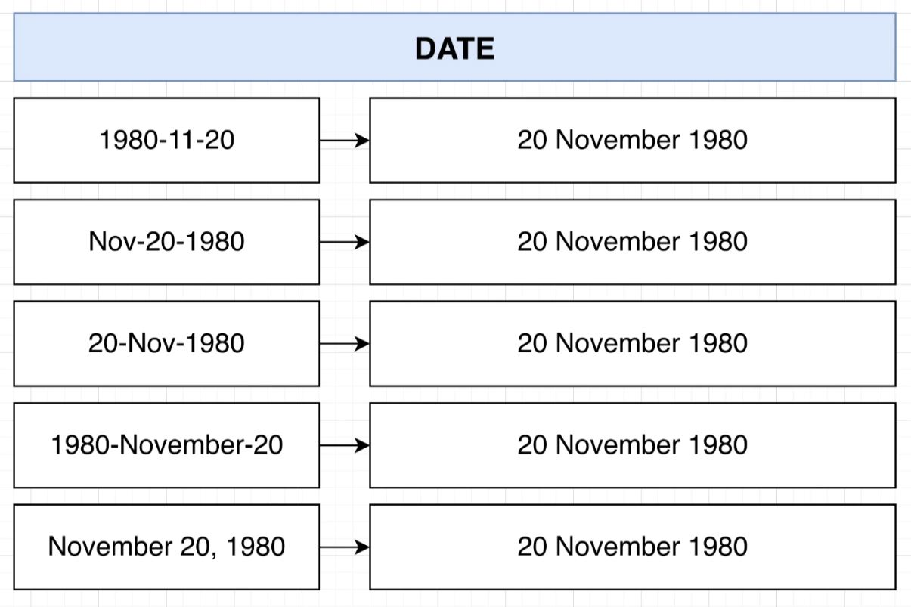
 

## Time (with and without Time Zone)

- Time:
  - You can provide a time and pg will format it to 24h time.
  - Type **TIME** is an alias for "Time without Time Zone"
    - You can put **TIME** or **TIME WITHOUT TIME ZONE**, they will do the same thing.

    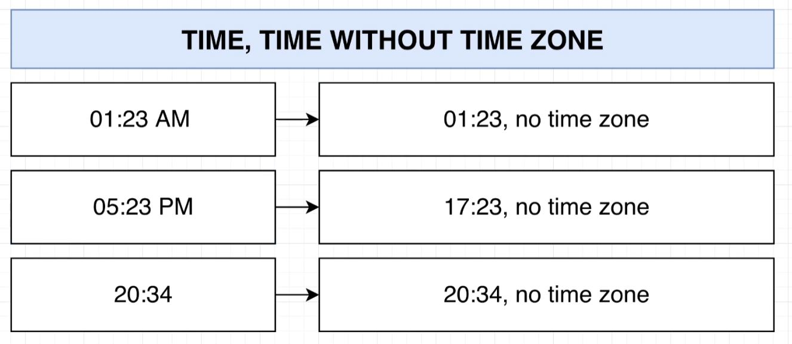

- Time with Time Zone:
  - If a time is provided with a time zone, it will be converted into the 24h UTC time value.
  - Type: **TIME WITH TIME ZONE**

    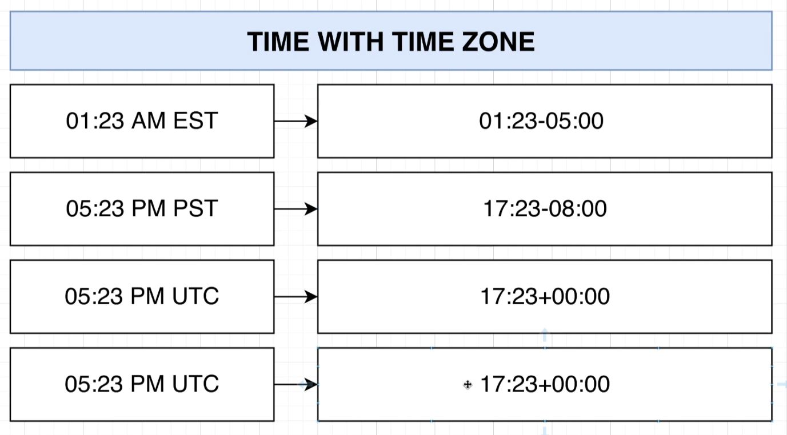

- TimeStamp:
  - Given a date and time string of any standard format, pg will format it to be a timestamp value.
  - Type: **TIME STAMP WITH TIME ZONE**
   
    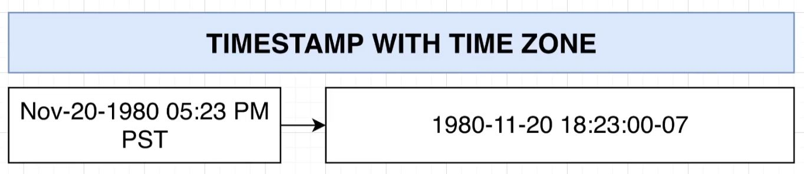
 

## Intervals

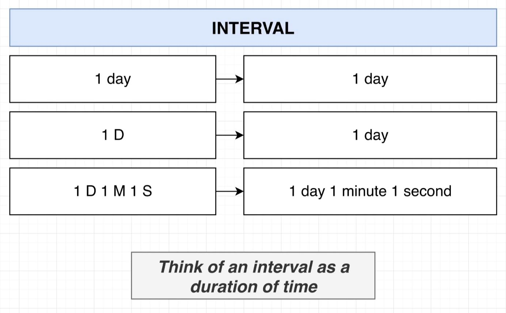

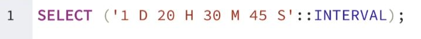
 

- **We can do numeric operations on intervals.**
  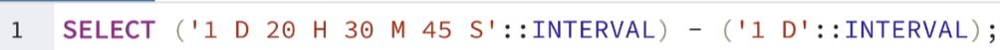
 

- **We can also do interval math between timestamps and timestamps, and timestamps and intervals.**
  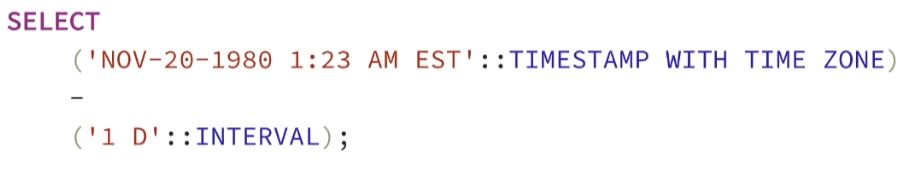
  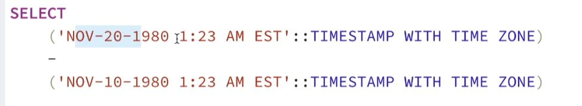
 

[<< PREV](../13_PG_Complex_Datatypes/index.md) - [HOME](../Frontpage/index.md) - [NEXT >>](../14_DB_side_Validation/index.md)
