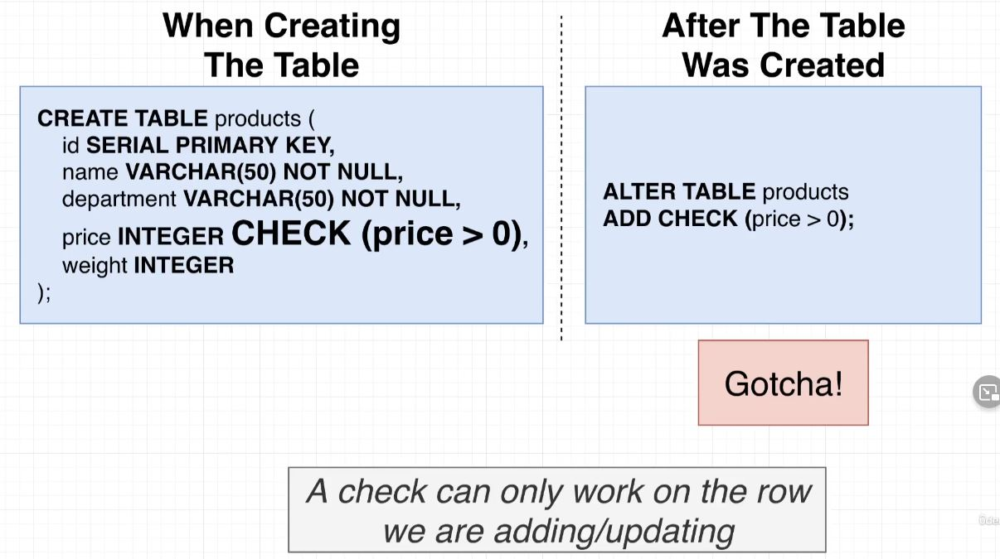

# Database-side Validation and Constraints

 

## Validation

- **Scenario 1: Interface through a web server.**
  - Notice that there is several errors in this request from the Admin, it is missing fields and the price is a negative number.
  - We need to implement some sort of validation on this request to ensure that the information we are receiving and putting in our database is correct.
    - We could do this validation at the web server level.

  
 

- **Scenario 2: Interfacing with the DB directly**
  - It would be very easy to input incorrect information when inserting directly into the db, but we can add validation at the db level to guard against incorrect information being input into our db.

  
 

## PG Admin Notes

  - We can see what database we are connected to at the top right of the application.

## Row Level Validation

 

## Apply a Null Constraint

- We can add the `NOT NULL` keyword after a value when we are creating a table to ensure that when we insert a new row into the table that the data is complete.
  - **If we attempt to put some data containing null or missing values into the table we will return an error and not insert or update the row.**

    

- We can also modify columns in the table AFTER it has been created, so as not to accept NULL values.
  - **There must NOT be any NULL values currently in the column if we wish to modify the column so that it will not contain any NULL values.**
   

## Solving Null Table Alteration Problem

- In order to update the column, we must first modify the NULL values to be a non-NULL value that is unique to all other values in the column.
 

  

- Once the column has been modified we can update the column to not accept NULL values.

  

## Default Value

- We can add default values when we create a table or we can alter an existing table using the `DEFAULT` keyword.
  - This ensures that we will not have a NULL value in our table if we set it up that way, or, ensures that if we have a NULL value we know it wasn't that way from the start.

  
 

## Applying a Unique Constraint to One Column

- If we want to ensure that all values within a column are unique, we can add the `UNIQUE` keyword when we are creating the table, or we can alter the table such that it will not allow duplicate values for a given table.
  - **Before we are allowed to alter the table we must first ensure that there are currently no duplicate values in the table.**
  - We can also add the NOT NULL keyword before the UNIQUE keyword.
  - The name of the column must be in parenthesis.

  

## Removing an Existing Constraint

- In order to remove an existing constraint we must first determine what pg has labeled the constrain.
  - We can find this information in PGAdmin:
  
   

  - Once we have the name of the constrain we can use the Query Tool to remove the constraint using the `DROP CONSTRAINT`:

  
 

## Multi-Column Uniqueness

- We can ensure that a combination of values in a given row is unique from the creation of the table, or by altering the table using the UNIQUE keyword and adding more than one column name within the parenthesis.
- **This is NOT declaring that both rows must contain unique values, only that the combination of the values within the given columns must be unique.**
  - E.g. 
    - You can have a [shirt, clothes] row and a [pants, clothes] row.
    - but you can have a [shirt, clothes] and another [shirt, clothes] row.
  
  

## Adding a Validation Check

- We can check to see if a value meets some specifically defined constraint using the `CHECK` keyword when we are creating the table, or the `ADD CHECK` keyword if we are modifying the table.
  - `>, <, >=, <=, =`
  - **We cannot modify a table column if some existing value within the column fails the check.**

  
 

## Checks Over Multiple Columns

- If we are adding multiple columns we will place the CHECK on it's own line.

  
   

## Where to Add Validation

- Short answer: both places.

  