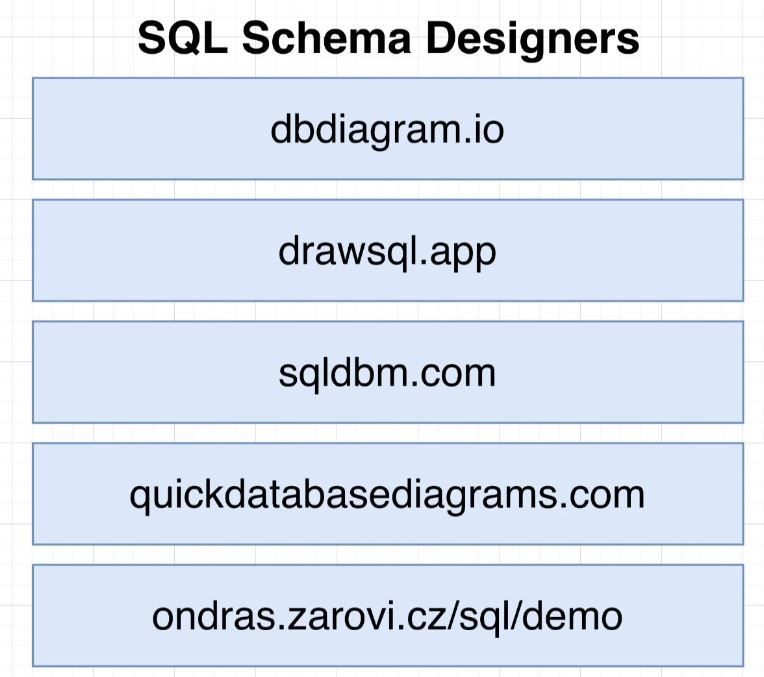
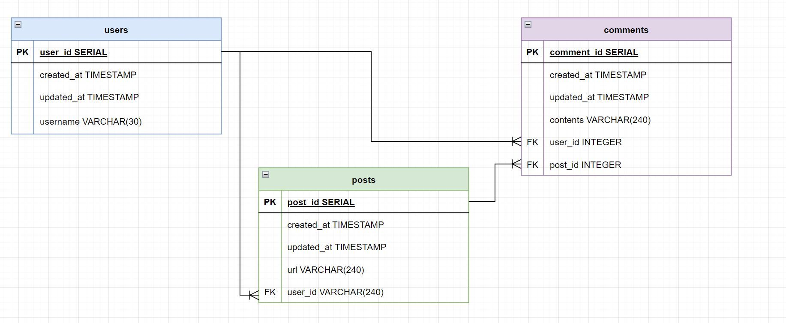

# Approaching More Complex Designs

 

## SQL Schema Designers

- Schemas are visual software programs, often diagram tools.
  - Visually represent the structure of your database.
  - Allow you to build out diagrams that
    - Show every table
      - Columns, datatypes, etc
    - Relations between tables
  - Assist with documenting database.
 

- Some Options:

  
   

- Diagram based
  - More click, drag and drop
- Config based
  - Closer to code based, but often uses their own language.

## Beginning Photo-sharing DB

