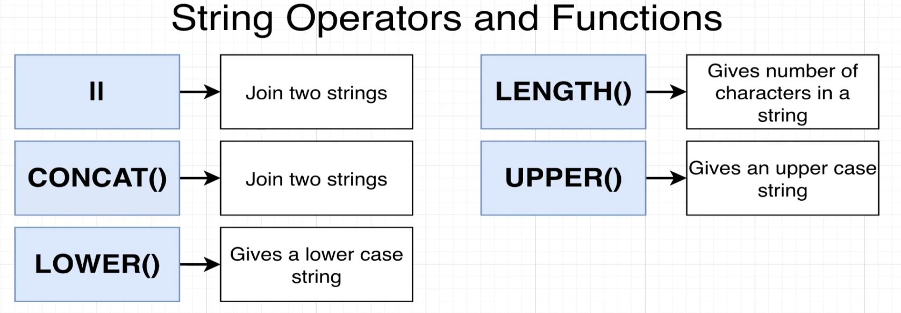

# Introduction to SQL Statements

## Database Design

- **Table**: **A table is a collection of records that sits in our db.**
  - A table generally can be though to hold things of a like kind, in our example case, the table is holding cities.

- Tables contain **columns**.
  - **Columns represents one property of the type of item that this table is intended to hold.**
  - In our example case *each column represents one property* of a city.
- Each **column must indicate the type** of the data held in it.

- Tables also contain **rows**.
  - **Rows hold a single instance (or record) of the items within the table.**
  - In our example case, *Seattle would be a single instance of a city*, and it's information would be contained in a single row.

## Creating Tables

- We will begin by using a browser based tool called: [pg-sql.com](pg-sql.com)

- **Always double check for correctness before submitting a query!!**

 
- Creating a cities table with 4 properties:

- This CREATE TABLE will look like this once the call is executed:

## Analyzing CREATE TABLE

- **Keywords:** Tell the database that we want to do something. Always written with **UPPERCASE** letters.
  - Can be thought of as instructions.
- **Identifiers:** Tell the database what thing we want to act on. Always written with **lowercase** letters.

- **VARCHAR** can be thought of as a string.
- It is important to understand the bounds of the data types.

## Inserting Data Into a Table

- Query:
  - Keywords: INSERT INTO 
  - Identifier: cities
  - Columns within parenthesis

- What is important is that we match the data we want to insert in the same order as the column we wish to insert the data into:

- We can insert multiple rows with one insert statement by adding row values separated by commas:

## Retrieve Data with Select

- To pull all the information from a table we can use the `*` character with the SELECT and FROM keywords:

- To pull all values from specific columns you can use the column(property) name:

## Calculated Columns

- SQL is not just about pulling raw data out of a table.
- **We can write SQL to *transform* or *process* our data before we receive it.**

For Example, we can calculate the population density by dividing the population by the area.
- **Notice:** The newly created column has a name of `?column?`. SQL knows we have done some math, but it doesn't know what to call it.

- We can add a name using the AS keyword.
- **Notice:** Now the new column has the name `density`.

- Example of some of the math operations we can do on the data.

## String Operators and Functions

- We can use operators and functions to manipulate strings:

- Operator Example:

- Function Example:

- Example of nested function calls:
  - **Notice:** the upper function call within the CONCAT function call.

