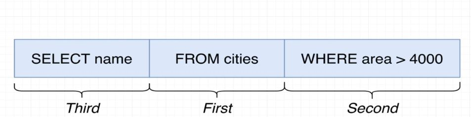
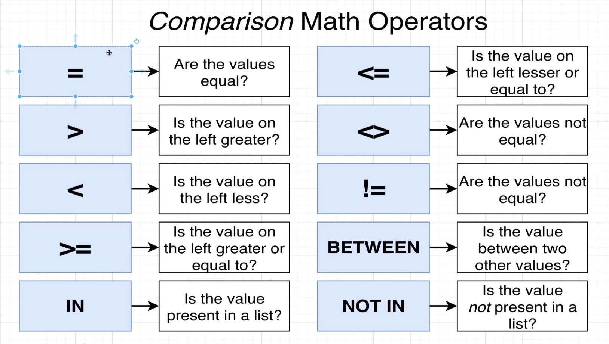
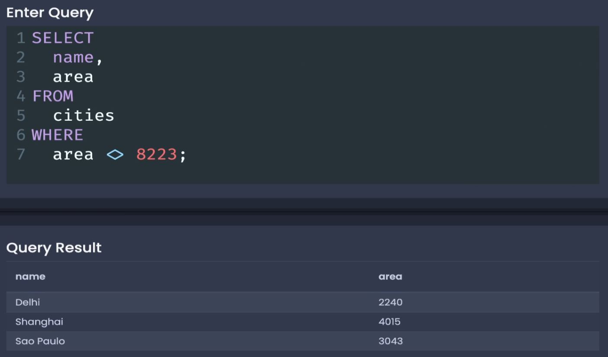
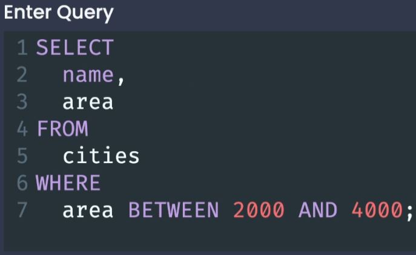
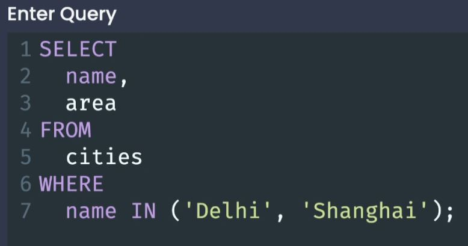
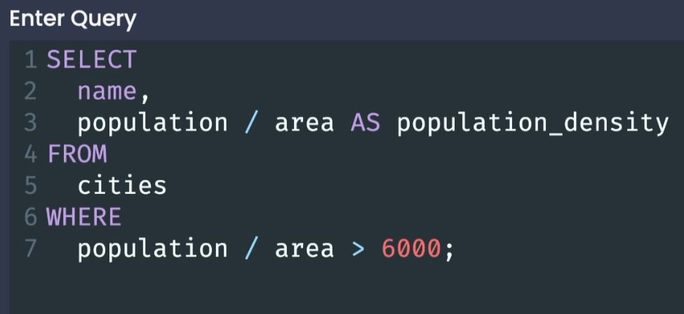
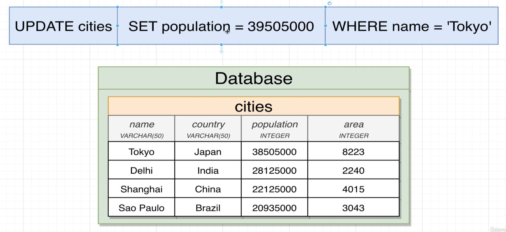
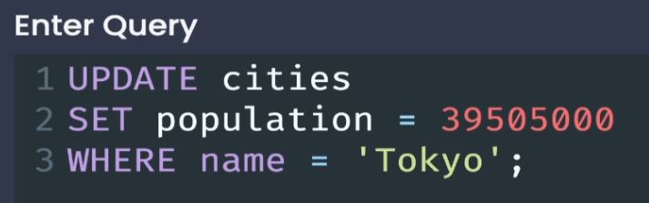

# Filtering Records

## Filtering Rows with WHERE

- The **WHERE** keyword followed by some condition lets us filter our results, receiving only the results that meet the condition we have set.

- The order that Postgres executes the query is not the same order in which it is written:

1. Find the database (table) you wish to retrieve information from.
2. Apply the filtering criteria. (for each row, I only want to consider the rows who's area is greater than 4000.)
3. For the remaining rows, give me every value from the names column.

## More on the WHERE keyword

- There are many comparison operations that we can use to act on our data:

- Example:

## Compound WHERE Clauses

- With the **BETWEEN** keyword we also must use the **AND** keyword.

- With the **IN** keyword we must select a column and the values we wish to find in parenthesis.

- We can use the **NOT IN** keyword in the same way to get all values that do not match the values found in the parenthesis.

> We can make a compound **WHERE** statement by using the **AND** keyword:

- We can also use the **OR** keyword in compound WHERE statements.

## Calculations in WHERE Clauses

- Just as we were able to do calculations in the SELECT portion of our query, we are also able to do calculations in there WHERE section:

## Updating Rows

- We use the **UPDATE**, **SET** and **WHERE** keywords to update a property on a given table.

- It is important that your WHERE statement is specific enough that you are only going to update the row (city) that you wish to update and not multiple rows.

## Deleting Rows

- You need to be careful about your WHERE statement in deleing as well, or else you may delete items you do not intend to. 

