# Working with Tables

 

## The Plan Moving Forwards

- Most all dbs have more than one table.
- Moving forward we will be working on a db for a photo sharing app.

## Approach to Database Design

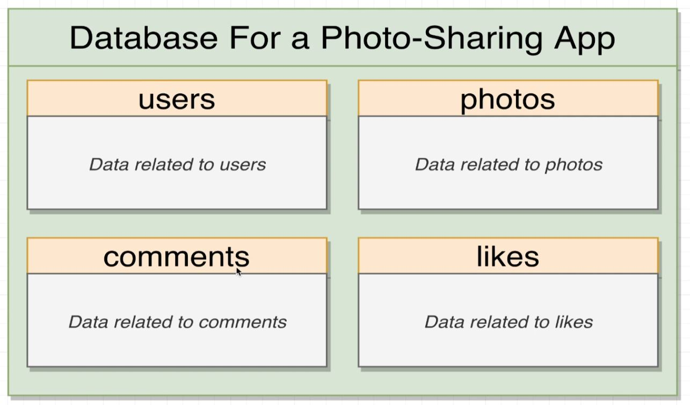

### What tables should we make?

- Whatever type of db you are making, it will most likely hold features that are common to many applications, eg: authentication, comments etc...
  - **There are tons of resources online on how to structure and implement your database for these features.**
  - GOOGLE IS YOUR FRIEND
- Identify/define what resources your application will need.
- Build mock ups for your application ahead of time.
- Find *relationships* or *ownerships* between tables in your db.

## Relationships

### The four relationships:

1. **One-to-Many**
  - User to Photos
  - From the **perspective** of the user.
  - There can be many photos, but they can only belong to one user.

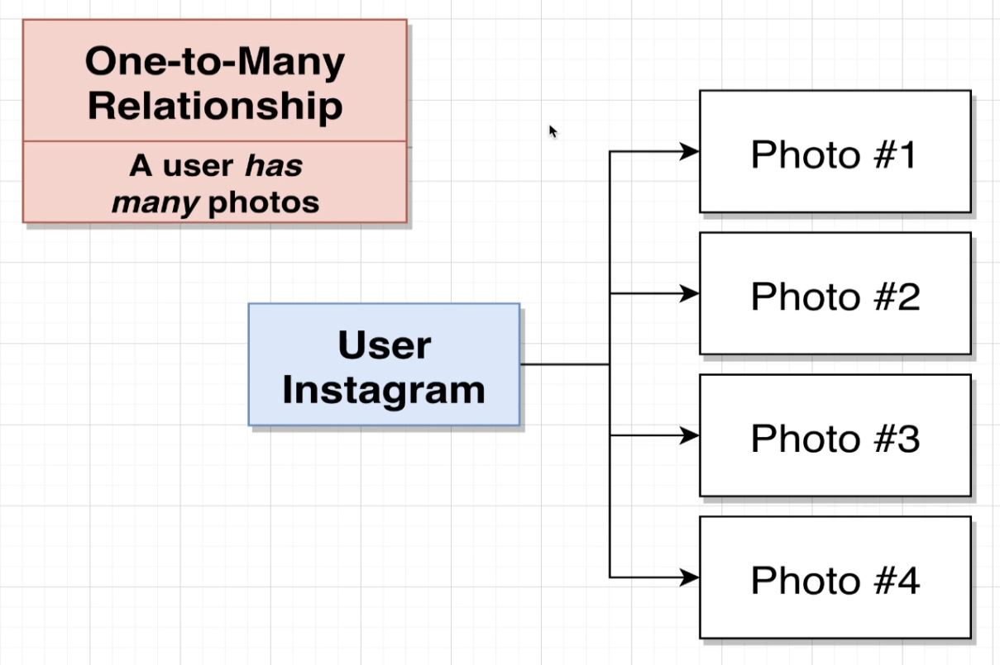

2. **Many-to-One**
  - There can be many photos, but they can only belong to one user.
  - From the **perspective** of the photos.

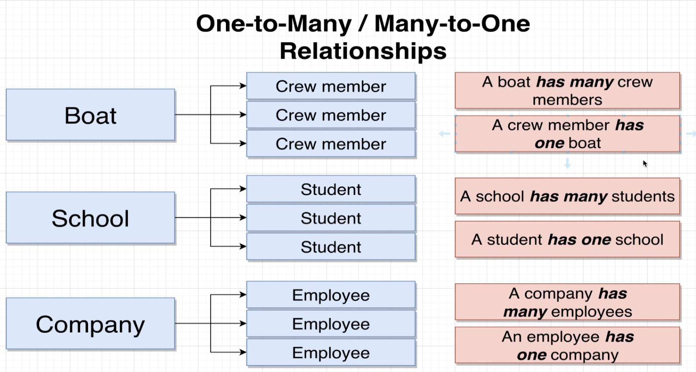

3. **One-to-One** 
  - One record that has a relationship to exactly one other relationship.

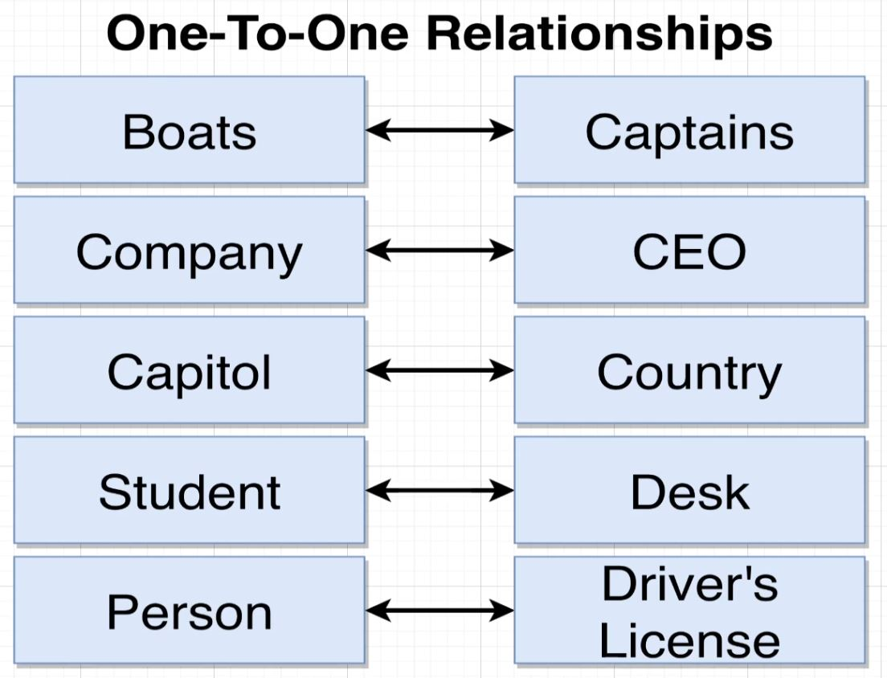

4. **Many-to-Many**
  - Many records connected to many other records.

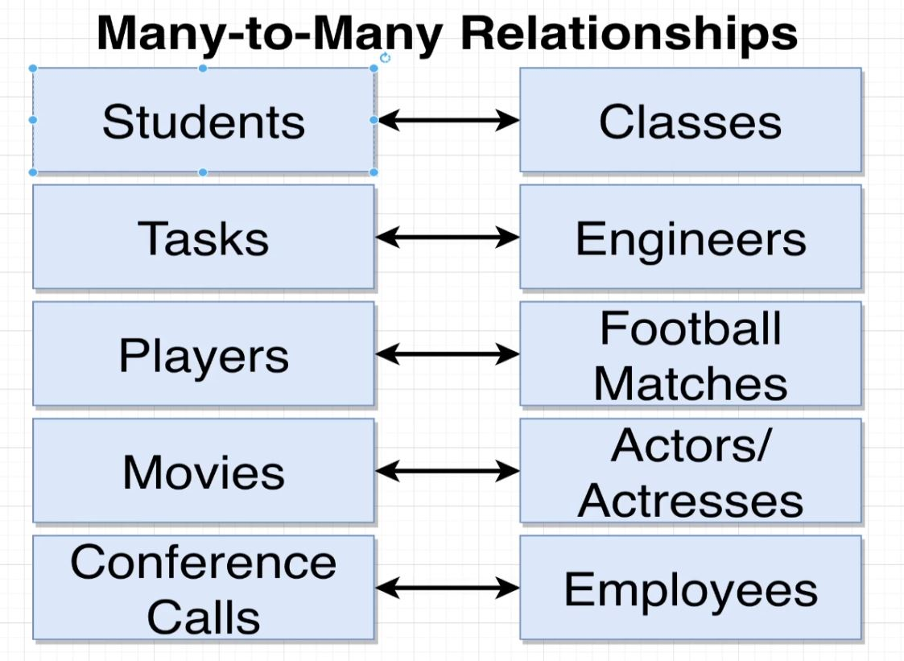

## Primary Keys and Foreign Keys

- **Primary Key:** **The goal of the primary key is to uniquely identify a single row (or record) inside of a table.**
  - Every primary key value is unique.
  - For every table, each row will have a primary key.
  - **99% of the time it is called 'id'.**
    - Either with an integer or a UUID.
  - **Will NEVER change.**

- **Foreign Key:** The goal of the foreign key is to relate some record to some other record.
  - Sets up a relationship between two records.
  - Tell which record this record 'belongs to'.
  - When you wish to set up a relationship between two records you will add a column for that key. Then populate that column with the primary key of the record you wish to set up the relationship with.
  - **Rows only **

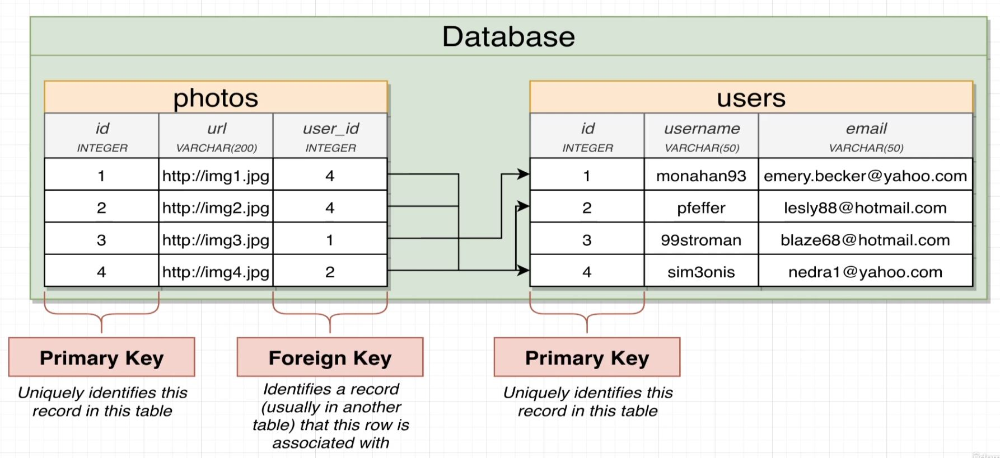

## Understanding Foreign Keys

> The **'many'** side of the relationship gets the foreign key column.

- Foreign keys **define** the relationship by pointing to which record a specific record belongs to.
- Rows only have a foreign key if they belong to another record.
- Many rows in teh same table can have the same foreign key.
- Usual format: 'xyz_id' where 'xyz' is some other record type.
- Will change if the relationship changes.

## Auto-Generated ID's

- Postgres has a built in ID generator.
- The `SERIAL` keyword tells pg that we want to generate the value automatically.
  - **When we insert new rows into the table we will not add an id, it will be generated by pg.**
  - The id will be the next available integer.
- We also need to add the `PRIMARY KEY` keyword to the id property to tell pg we intend to use it as a primary key.

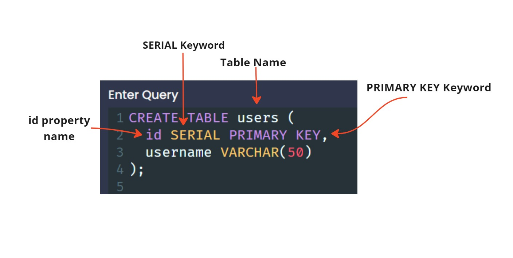

## Creating Foreign Key Columns

- Foreign Keys allow for 'consistency' in our data.

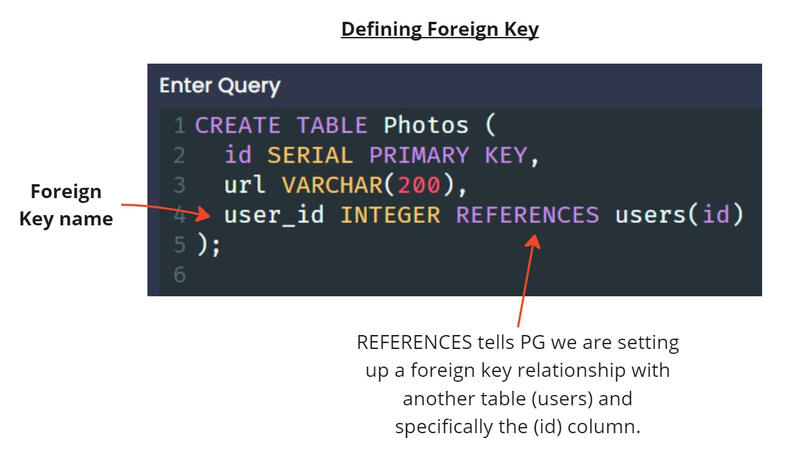

## Running Queries on Associated Data 

Two ways we can retrieve the photos for a given user:
  - We will talk more about JOINS soon

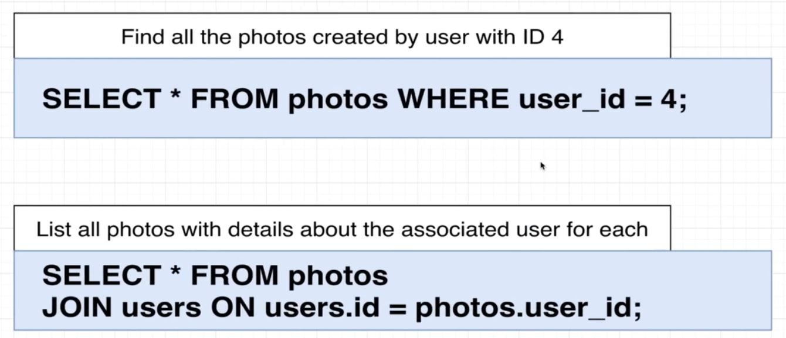

## Foreign Key Constraints Around Data Insertion

- We need consistency with our data, for example, if we insert a photo into our photos table, we need to ensure that the user we are attempting to associate that photo with actually exists.
  - If we attempt this scenario, we will get an error in return.

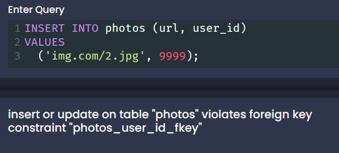

- **Because we have set up the Foreign key PG knows to check for the associated Primary key.**

 

- If we wish to add a photo and not associate it with a user, we can use `NULL` in the user_id field.

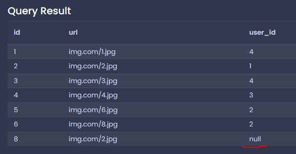

## Constraints Around Deletion

- Delete options are added when the table is created.

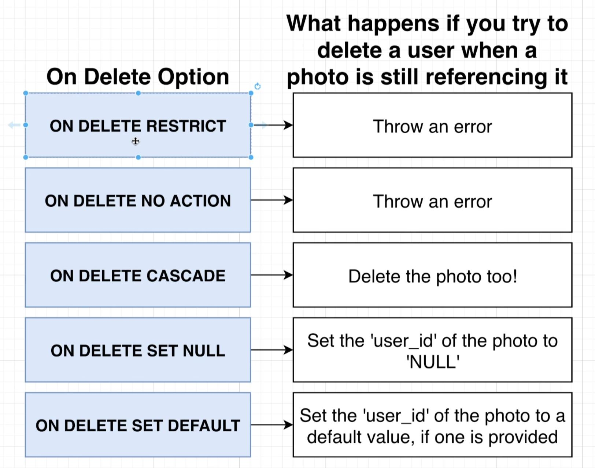

- **ON DELETE RESTRICT** is the default option if no option is listed.

## Setting Delete Options

- We add the delete option to the Foreign Key property

[<< PREV](../2_Filtering_Records/index.md) - [NEXT >>](../4_Relating_Records/index.md)