# Relating Records with Joins

- In this section we are going to be working with a prebuilt db for a basic photo sharing app:

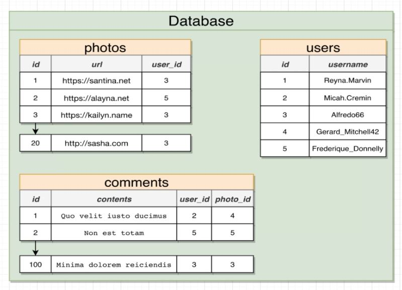

 

## Queries with Joins and Aggregators

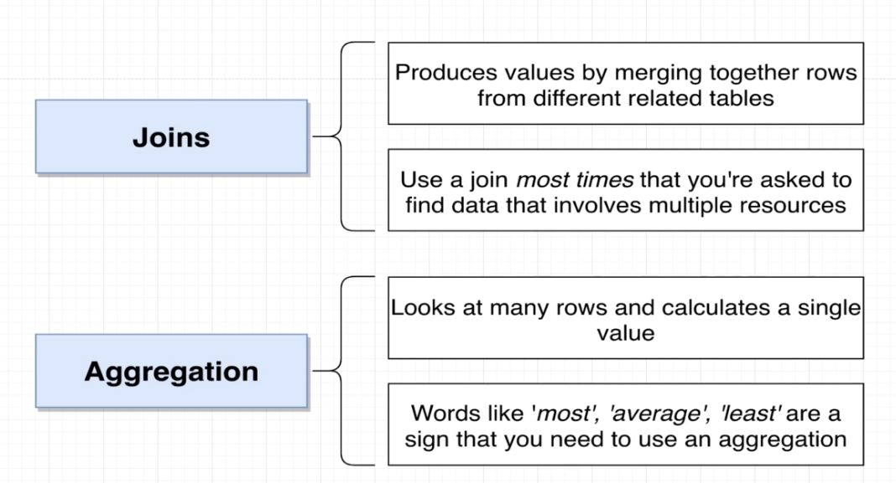

## Joining Different Tables

- Here we are going to try to display the content of the comment along with the username of the commenter.
  - Note that the username and the comment are in different tables.

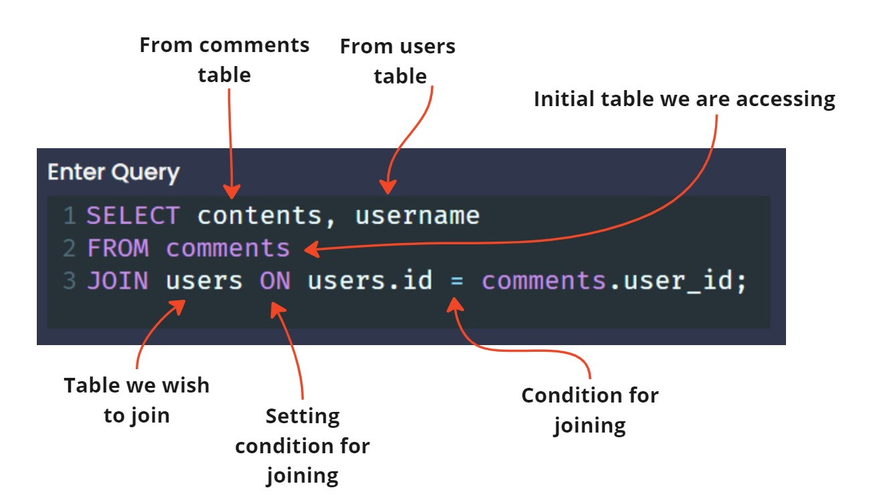

- When we ask pg to `JOIN` tables we can think of it as temporarily creating a new table matching rows as the condition defines.

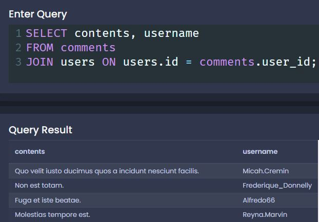

- One more example query using `JOIN` to display comments and the url for the associated photo:

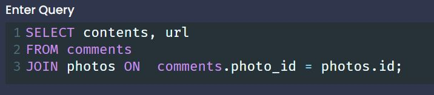

## Alternate Forms of Syntax

- Table order between `FROM` and `JOIN` will *usually* many a difference.
 
- We must give context if column names collide.
  - If this happens we will end up with an error statement:
    - `column reference "id" is ambiguous`
  - We can clarify which column we want by adding the table name and a `.` before the column name:
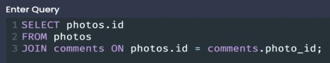
- Tables can be renamed using the `AS` keyword.
  - This is convenient when making large or complex queries.
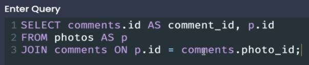
  - You can also drop the `AS` keyword all together:
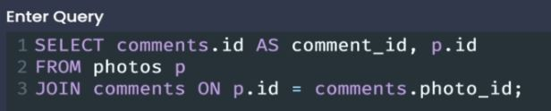
  - It is recommended to keep the `AS` for clarity.
- There are several kinds of 'joins'.

## Missing Data in JOINS & Why Wasn't It Included

- What happens if we want to show every photo in our db and the associated user id, but not all photos have users associated with them (null in 'user_id' field)?
  - If we try something like this:
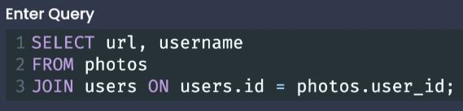
  - We no photos with a `null` value in the user_id field will be shown.

 

- It does not join because a `null` value does not meet the `ON` condition.

## Four Kinds of JOINS

- [Link to Joins Cheatsheet](../Cheat_Sheets/joins_cheatsheet.pdf)

- Up to this point we have be using an 'Inner Join'

- Types of JOINS:
  - **Inner Join**
  - **Left Outer Join**
  - **Right Outer Join**
  - **Full Join**

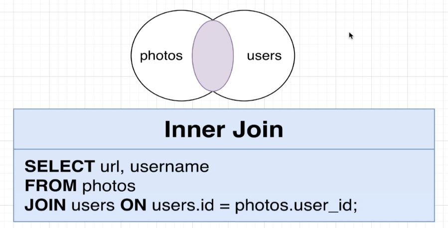

- **Inner Join**
  - The default Join method.
  - `JOIN` or `INNER JOIN` can be used interchangeably.
  - Inner join will join the specified tables together, when there are rows in one table that don't match up to rows in the other table, the the rows in both tables that do not match are dropped.
    - *We only keep rows that match up to a row in the other table.*

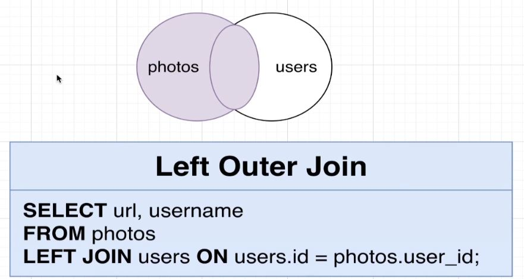

- **Left Outer Join**
  - If any row from the first table does not match up with any row in the 'joined' table, we are not going to drop it off. 
    - In the example above, if any row from the *photos* table does not match up with any row in the *users* table, we are **NOT** going to drop it off.

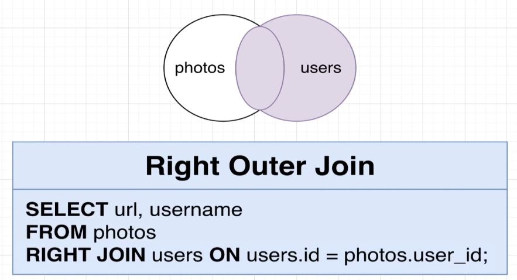

- **Right Outer Join**
  - Opposite of a Left Outer Join.
  - If any row from the 'joined' table does not match up with any row in the first table, we are not going to drop it off. 
    - In the example above, if any row from the *users* table does not match up with any row in the *photos*  table, we are **NOT** going to drop it off.

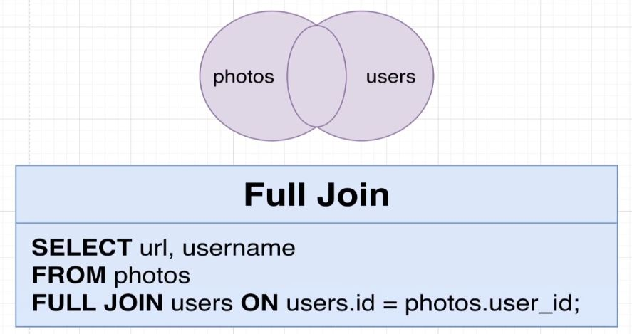

- **Full Join**
  - Join everything, drop nothing. Merge everything you can and then include everything else.

## Does Order Matter?

- The order of the `FROM` table and the `JOIN` table will make a difference when doing a `LEFT` or `RIGHT` `OUTER JOIN`.

## Where with Join

- We can add a `WHERE` to a `JOIN` statement to filter out results.
- `WHERE` will always come **after** the `JOIN` clause.

 

- Example:
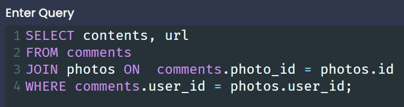
  - Here we can see `WHERE` used to filter all comments to only show comments made by the user who posted the photo.

## Three Way Joins

- We are not limited to joining two tables together.
- We can add additional `JOIN` statements to include more tables.
- *When we begin adding more joins, we need to be even more aware of our* `ON` *condition.*

- Here we see an example
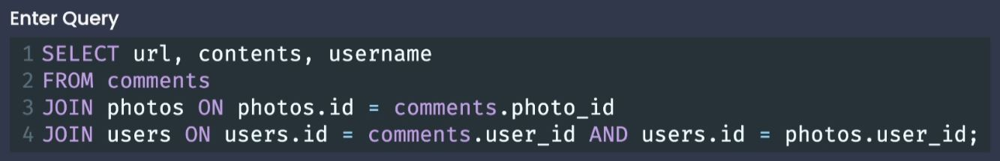

[<< PREV](../3_Working_with_Tables/index.md) - [HOME](../Frontpage/index.md) - [NEXT >>](../5_Aggregation_of_Records/index.md)