# Aggregation of Records

 

## Keyword Ordering:

- All of the KEYWORDS are going to appear in a very specific order.

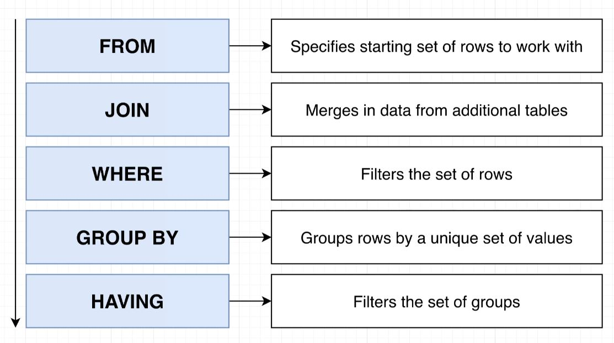

## Aggregating and Grouping

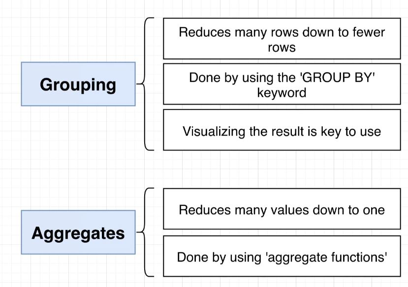

  - **Grouping:** Reduces the total number of rows down to a smaller group.
    - Done using the `GROUP BY` keyword
  - **Aggregates:** Reduces many values down to one.
    - Done by using *Aggregate* functions.
 

  - **If we do not include a column in our `GROUP BY` then we cannot access it in our `SELECT` statement!** 
    - This will come up several times.

## Picturing GROUP BY

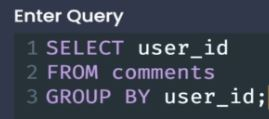

  - `GROUP BY` is always **two separate words**.
  - Will find all the unique values within a table.
  - **Can only select those columns which you are grouping by.**
  - Not very interesting on it's own, will become more useful once combined with aggregate functions.

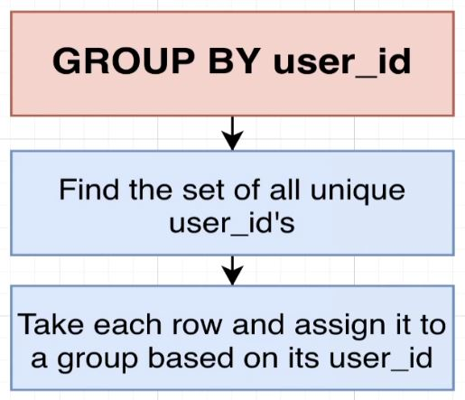

- **You can picture `GROUP BY` as your db setting up tables made from each group:**

  - notice that each "group table" is made up of comments by a single user, because that is what it was grouped by.
  - 
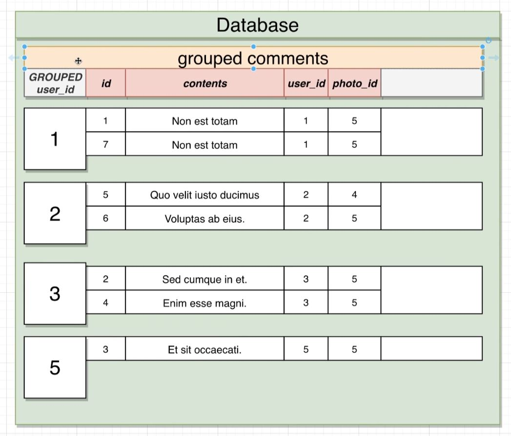

## Aggregate Functions

- The goal of an **Aggregate Function** is to reduce many different values down into just one.
  - Examples of some of the most common aggregate functions:

- Aggregate functions are used either by themselves or in combination with GROUP BY statements.
- We use aggregate functions in the select statement.
  - We pass in the column we wish to aggregate to the aggregate function after the `SELECT` keyword.
  - **Can be thought of like .reduce() in JavaScript**

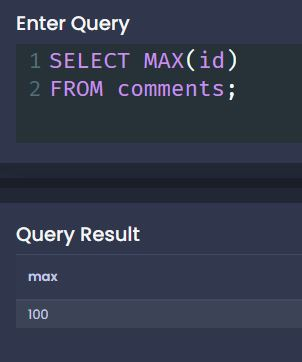

- When we make use of an aggregate function, we **CANNOT** do a normal select next to it, we can only do GROUP BY selects and aggregate functions together.

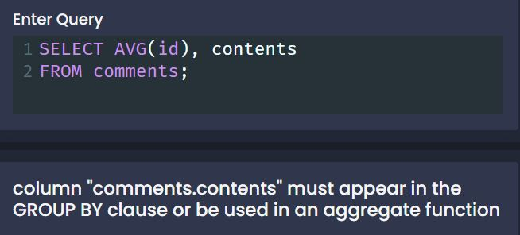

## Combining Group By and Aggregate Functions

- **When used in combination with GROUP BY, an aggregate function will only be applied to each sub-group, not the whole.**
- Aggregate functions is when we can really start doing things with our data.
- In the example below, we are grouping all user IDs in the comments table, then finding out the largest ID for each user.
  - So we are first grouping the users together, then we are looking for the max comment ID for each user.

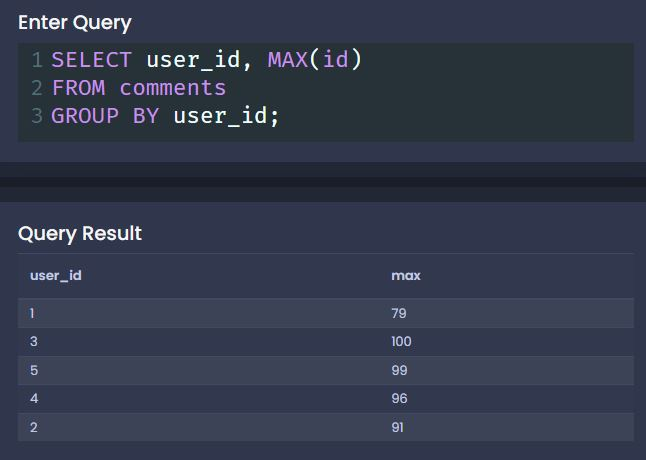

- This is not the most useful example, but if we use the `COUNT()` aggregate function we can see how many comments each user has made:

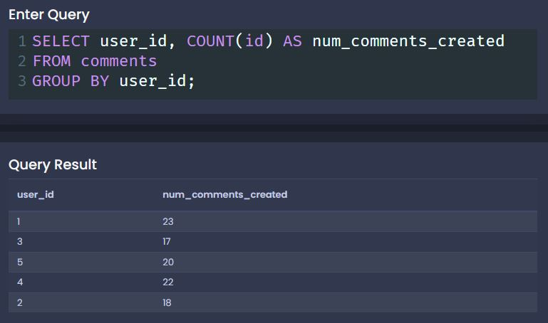

## Corner Case to be Aware of with COUNT()

- **NULL VALUES ARE NOT COUNTED!**

- To get around this, if you want to count all numbers within a row, you can use the `*` symbol to tell PG to count ALL rows:

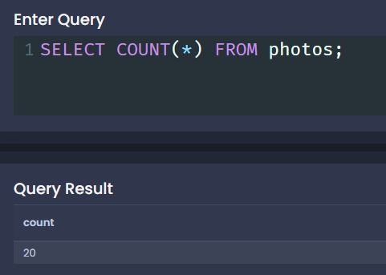

- We can use this method with our `GROUP BY` to count all rows for a given grouped value.

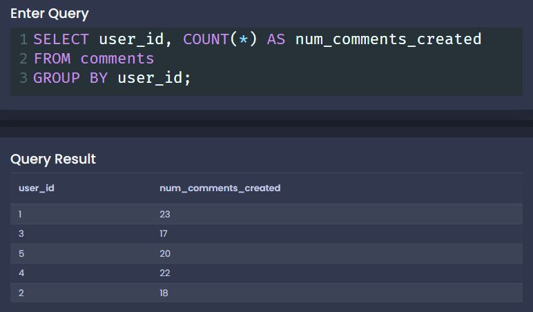

- **In general, we are going to use the `*` symbol when using `COUNT()` instead of counting some individual column.**

## Filtering Groups with HAVING

- **`HAVING` filters groups.**
 

- `HAVING` is very similar to `WHERE`, it's goal is to filter some set of results.
  - `WHERE` is going to filter out some set of **rows**.
  - `HAVING` is going to filter out some set of **groups**
 

- **You will never see `HAVING` without `GROUP BY`.**

## More on Having

- Sometimes it is easier to write your first filter statement, then reflect on the data you have before moving on.