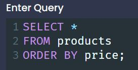
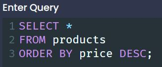
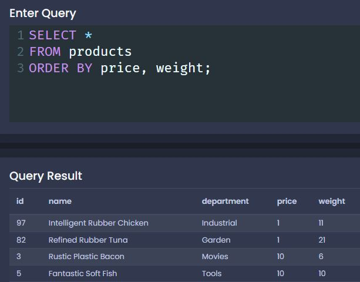
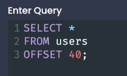
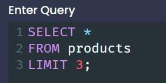
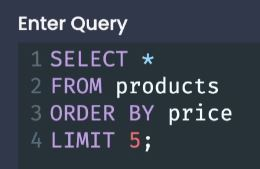
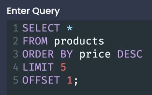

# Sorting Records

 

## The Basics of Sorting

- We use the `ORDER BY` keyword to sort our query results.

  
 

- **The default order will be ASCENDING**
- To change the order you can apply an optional keyword `DESC` (short for descending) after the column which wish to order by:

 

## Two Variations on Sorting 

- We can order by character as well as by number.
- We can apply a second ordering rule, the first will be given priority.
  - The second will be followed when two entries are equal.
  

## Offset and Limit

- We can use a column to order by, but we can also use a calculation to order by.
  - For Example: `price / weight`
 

- `OFFSET` - Any time we want to skip some number of records within a result set.
  
 

- `LIMIT` - will constrain the number of records we get back from a query.
  
  - `LIMIT 1` will give you the most or least of some result.
 

- Combining `LIMIT` and `ORDER BY`
  - We can do things like get the 5 least expensive products by combining the two
  
 

- Combining `LIMIT`, `ORDER BY` and `OFFSET`
  - We can do things like get the 4 most expensive under the very most expensive product by combining all three
  - `LIMIT` **goes before** `OFFSET`
  

 

- Combining `LIMIT` and `OFFSET`
  - We can combine offset and limit to decrease the size of our result set.
  - If we have 1000s of results we would not want to return the entire result set, we would want to return only some ***limited*** number of those results at a time.
    - We can also keep track of where our offset is incase we wish to request more of those results.

[<< PREV](../6_Working_with_Large_Datasets/index.md) - [NEXT >>](../8_Unions_and_Intersections/index.md)