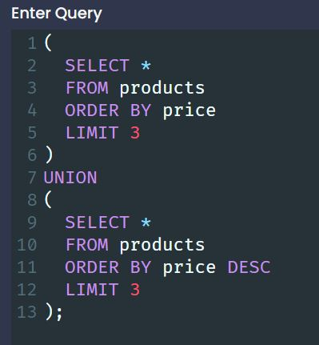
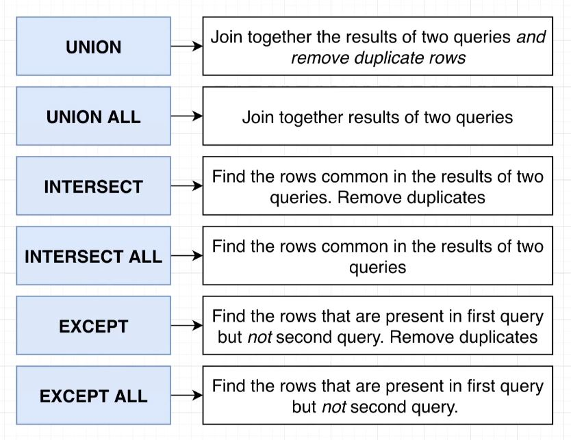
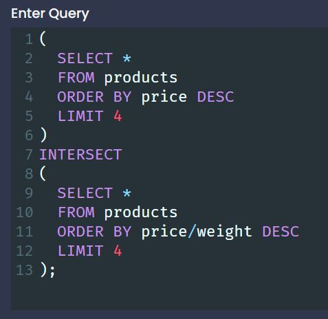

# Union and Intersections with Sets

 

## Handling Sets with Union

- `UNION` will append two or more queries together
  - The queries are wrapped in parenthesis with the UNION keyword in the middle.

 

  - By default, UNION will not show duplicates
    - To show duplicate values use `UNION ALL`

## A Few Notes on Union
  - Parenthesis are not strictly necessary, but are good practice.
  - We are only allowed to use the UNION keyword where the results of the queries will have the **same columns.**

## Commonalities with Intersect

- `INTERSECT` - Will give us the common results between two queries.

 

- `INTERSECT ALL` - Will give us the common results between two queries and show any duplicates **as long as those duplicates exist in both results prior to intersection**.

## Removing Commonalities with Except

- `EXCEPT` - Finds the rows that exist in the first result set that **DO NOT** exist in the second result set.
  - **Order matters for EXCEPT**
    - We only care about the rows in the FIRST result set. Any rows from the second set that do not exist in the first result set do not matter.
 

- `EXCEPT ALL` - EXCEPT but does not remove duplicates.

[<< PREV](../7_Sorting_Records/index.md) - [HOME](../Frontpage/index.md) - [NEXT >>](../9_Assembing_Queries_with_SubQueries/index.md)
