# Assembling Queries with SubQueries

 

## What's a Subqueries?

- A subquery is a method in which a query is used as a part of a greater query.
- To create a subquery, we wrap the subquery inside of parenthesis.
  - This works to tell pg that we want to execute the subquery first before using the results in the outer query.
  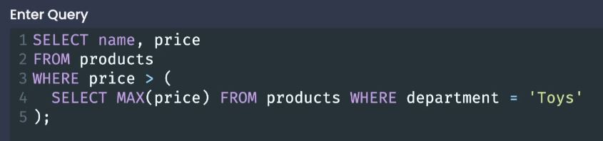
 

## Thinking About the Structure of Data

- Subqueries can be used in many different locations

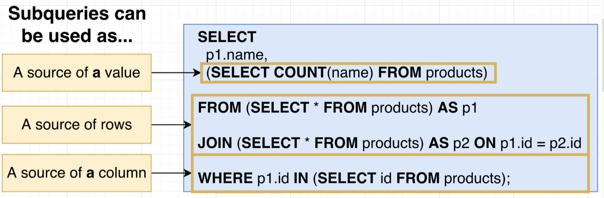

- To understand how to properly use subqueries, we must understand the shape of the result of a given query.

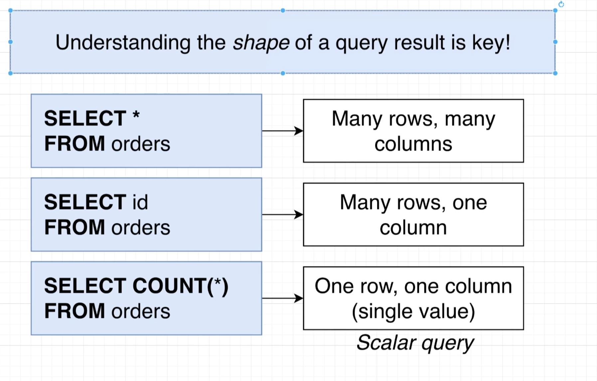
 

## Subqueries in a Select

- If we want to add a subquery into a SELECT statement we must return a **single value**.
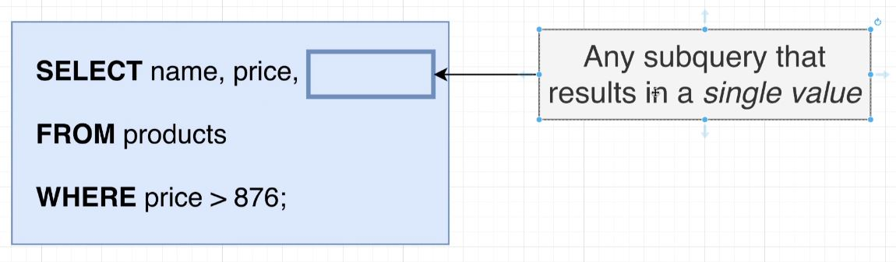
 

## Subqueries in a Form

- You can think of a subquery in the FROM statement as building a table from which we will run the outer query on.
- Our outer query's SELECT statement **must be compatible with the table we make.**
- Whenever we make use of a subquery inside of a FROM statement we **must use an alias**.

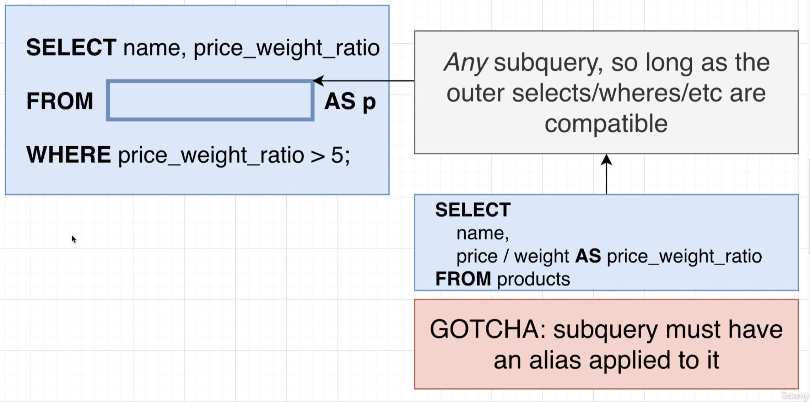
 

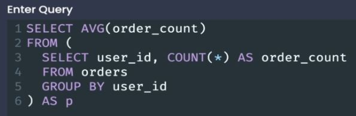
 

## Subqueries in a Join Clause

- We can add a subquery in a Join Clause so long as the returned data is compatible with the following 'ON' clause.
  - Whenever we make use of a subquery inside of a Join clause we **must use an alias**.
  
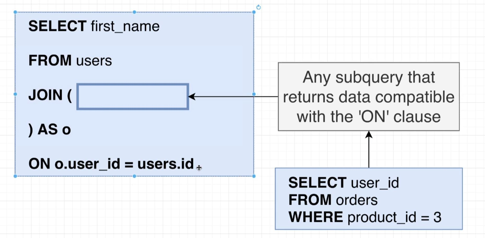
 

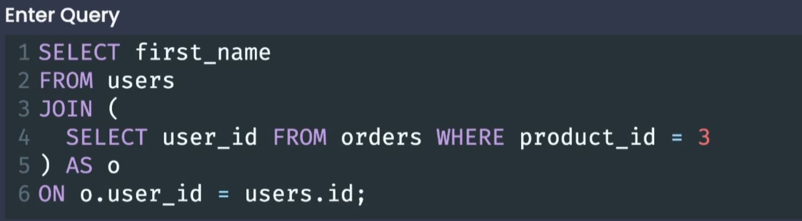

## Subqueries with Where

- More useful than previous examples.
- Reminder: WHERE is used to filter out some number of rows.
- Sometimes the same result can be achieved by just using a JOIN instead, however, often times it is easier to use a subquery instead.
   

- A valid subquery is going to be valid (or not) **depending on the operator used in the WHERE clause**.
  - In some cases, the return value may need to be a single value, whereas other times it may need to be a list or a column of values.

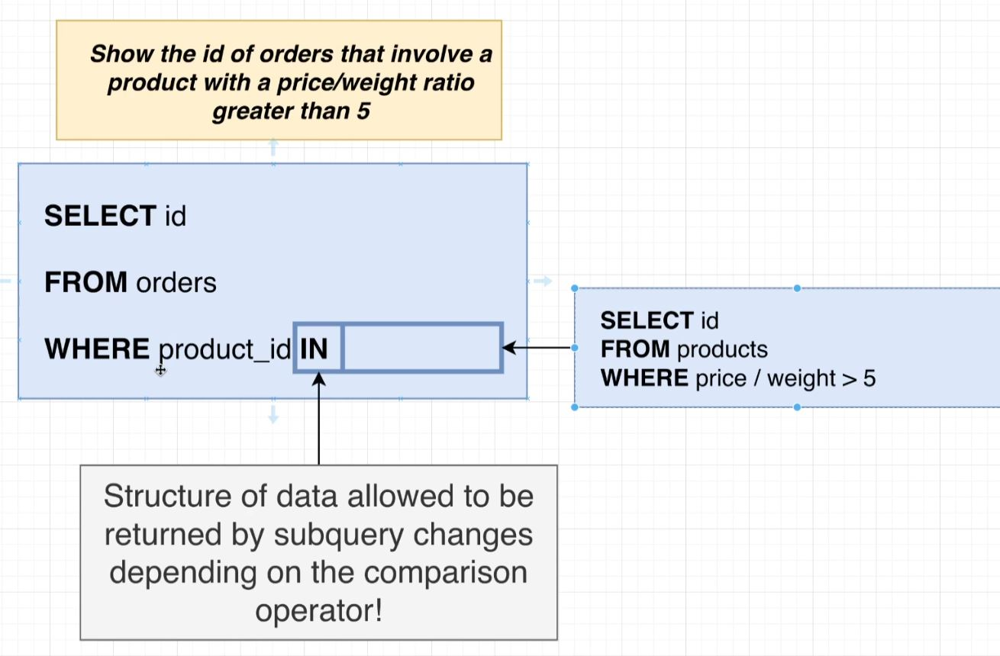
 

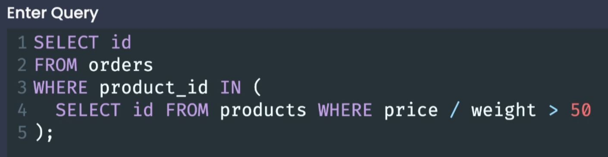
 

## Data Structures with Where Subqueries

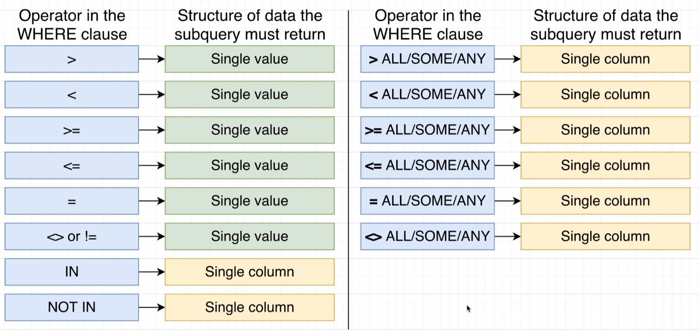
 

## ALL - Where Operator

- The ALL operator is preceded by a comparison operator, and will consider all values from within the given comparator. 

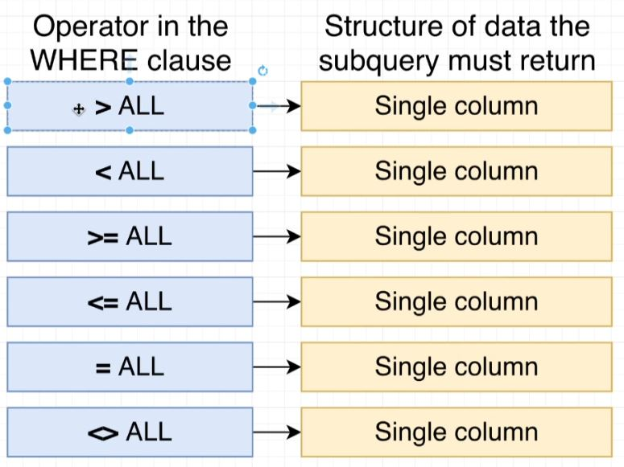
 

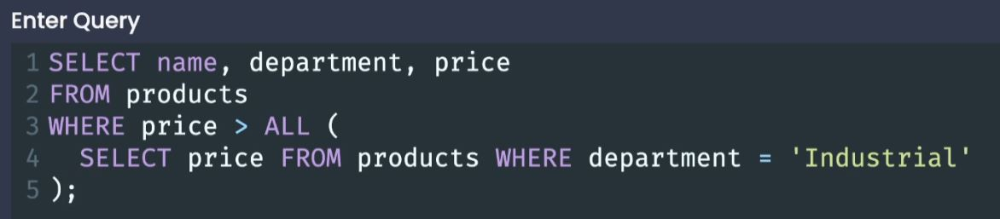
 

## SOME/ANY - Where Operator

- **SOME is an alias for ANY** they can be used interchangeably.
  - The SOME/ANY operator is preceded by a comparison operator, and will consider each individual value from within the given comparator. 

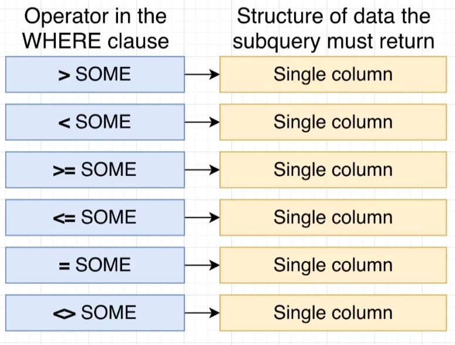
 

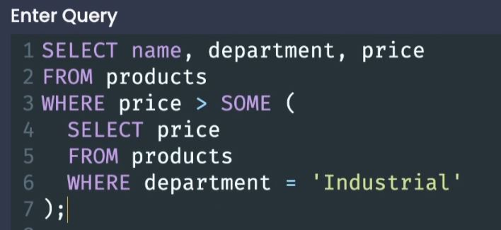
 

## Correlated Subqueries

- A WHERE clause evaluates every row in a given table, when we have a subquery within a WHERE clause, that subquery is executed for each row the WHERE clause evaluates.
  - Each time that a row is evaluated, the subquery runs with the context of that row.
  - **You can think of it as kind of like a nested for loop**
 

- **We can refer to the outer query values from within the inner query (like a nested for loop).**
  - The tables in the FROM clause need to have an ALIAS.
- A correlated subquery can be used anywhere a subquery can be used.

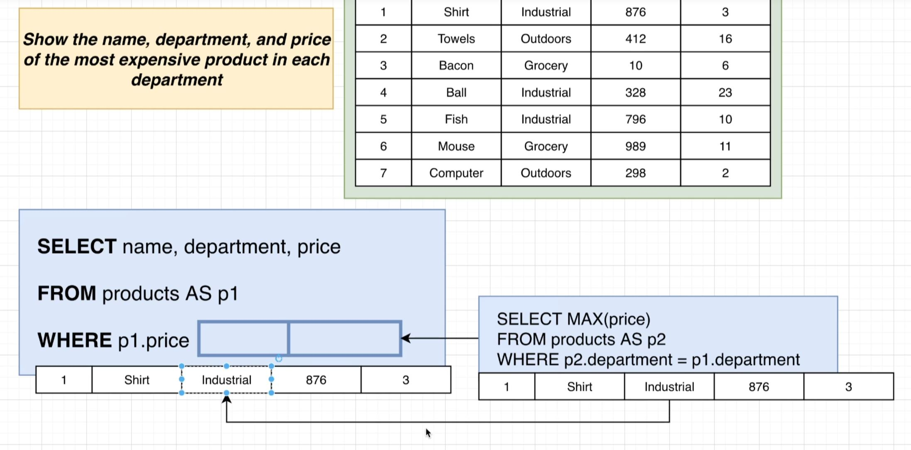
 

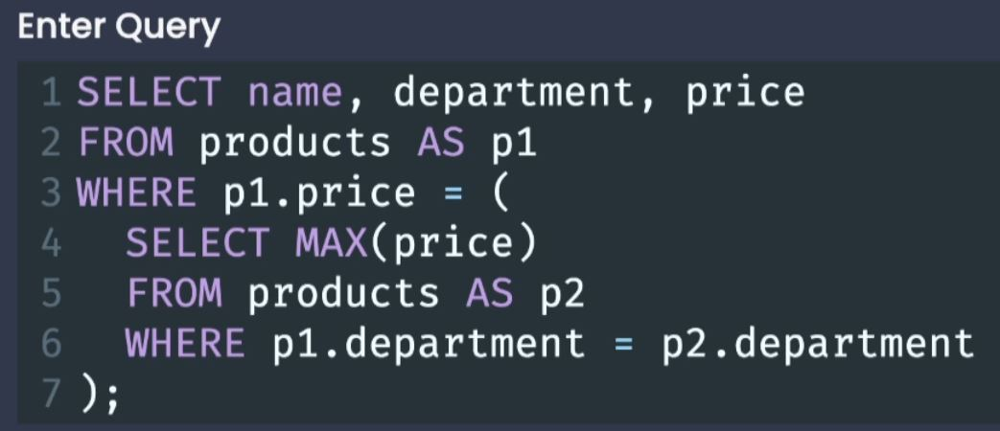
 

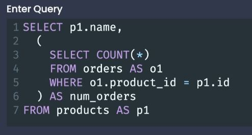
 

## Select without a FROM

- If we put a subquery into the SELECT clause, we do not *technically* have to add a FROM clause.
  - Good for calculating, such as finding things like ratios.

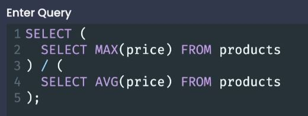

[<< PREV](../8_Unions_and_Intersections/index.md) - [HOME](../Frontpage/index.md) - [NEXT >>](../10_Selecting_Distinct_Records/index.md)
